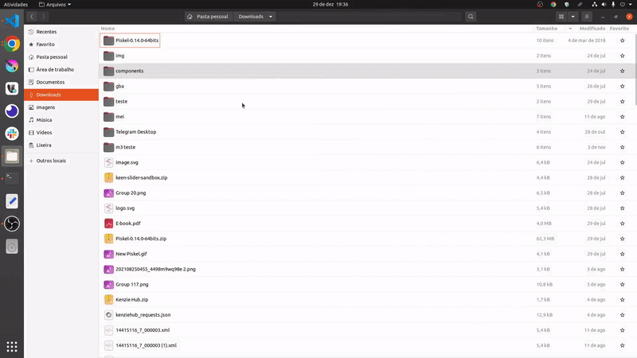

# Organizador-de-arquivo

## Um organizador de pasta usando a biblioteca <a href="https://pypi.org/project/python-magic/">python-magic 0.4.27</a> como identificador de arquivo.

## Para rodar o projeto

    instalar as depedencias do projeto num ambiente virtual
        -linux exemplo
            -python -m venv venv
            -source venv/bin/activate
            -pip install -r requirements.txt
    e rodar o main.py

    

### Feito por Antonio pedro.
